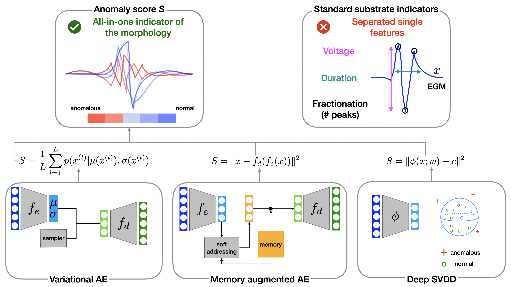

# DeepAtrialAnomalyDetection
_All-in-one electrical atrial substrate indicators with deep anomaly detection_ [BSPC 2024]




This repository implements a framework for detecting anomalies in atrial electrogram (EGM) signals using deep learning techniques and classical methods. The project is based on the paper [All-in-one electrical atrial substrate indicators with deep anomaly detection](https://doi.org/10.1016/j.bspc.2024.106737), published in _Biomedical Signal Processing and Control_.

## Libraries Used

The implementation relies on the following libraries:
- `numpy`
- `pandas`
- `scipy`
- `torch`

## Code Structure

### Main Script
- **`test_patient.py`**  
  This script executes the anomaly detection method for a specified test patient while training the model using a list of other patients. 

### Input Files
For each patient, the following files must be placed in the `patients` directory:
1. `{patient_name}_unipolars.npy` - Contains unipolar signals.
2. `{patient_name}_bipolars.npy` - Contains bipolar signals.
3. `{patient_name}.csv` - A CSV file with information about the data points, such as voltages, activation times (AT), and optionally coordinates.

### Output
The output is saved in the `indicators` directory. For each signal, the following are computed:
- Classic indicators (e.g., Fractionation Index, Duration, Voltage).
- Anomaly scores from deep learning methods.

### Supporting Files
- **`models.py`**  
  Contains the implementation of the deep learning methods.
  
- **`indicators.py`**  
  Includes methods for calculating the classic indicators.

- **`preprocess.py`**  
  Provides methods for preprocessing the signals.

- **`train_utils.py`**  
  Contains utilities for training the deep learning models.

## Citing the Paper

If you use this code, please cite the following paper:

```bibtex
@article{BINDINI2024106737,
  title = {All-in-one electrical atrial substrate indicators with deep anomaly detection},
  journal = {Biomedical Signal Processing and Control},
  volume = {98},
  pages = {106737},
  year = {2024},
  issn = {1746-8094},
  doi = {https://doi.org/10.1016/j.bspc.2024.106737},
  author = {Luca Bindini and Stefano Pagani and Andrea Bernardini and Benedetta Grossi and Andrea Giomi and Antonio Frontera and Paolo Frasconi},
}
```


## LICENSE
<a rel="license" href="http://creativecommons.org/licenses/by-nc/4.0/"></a><br />All material is available under [Creative Commons BY-NC 4.0](https://creativecommons.org/licenses/by-nc/4.0/). You can **use, redistribute, and adapt** the material for **non-commercial purposes**, as long as you give appropriate credit by **citing our paper** and **indicate any changes** you've made.
